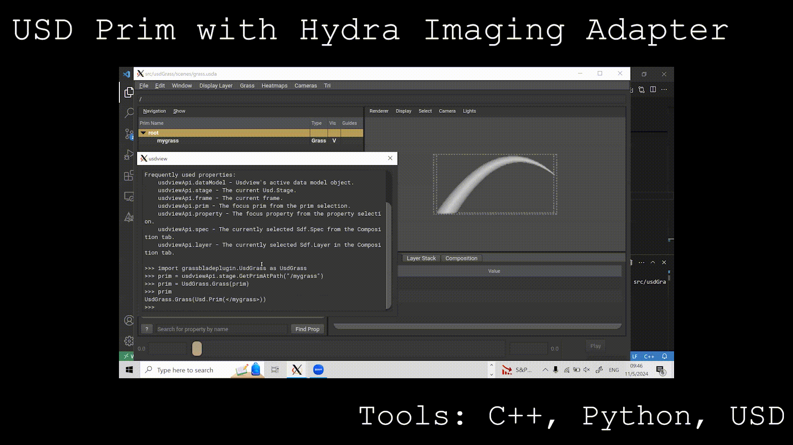

# GrassBladePlugin

A plugin for [Pixar's USD](https://github.com/PixarAnimationStudios/USD) (Universal Scene Description) that defines a custom schema for a grass blade, a Hydra Imaging Adapter for it, and a utility plugin for usdview for creating a grass blade prim.

## Table of Contents

- [USD Plugins](#usd-plugins)
- [Dependencies](#dependencies)
- [Building](#building)
- [Running](#running)
- [Plugin Demo](#plugin-demo)
- [Attributions](#attributions)

## USD Plugins

**GrassBladePlugin** provides the following USD plugins:
- [usdGrass](./src/usdGrass): A schema library defining a **Grass** prim type.
- [usdGrassImaging](./src/usdGrassImaging): A *Hydra 1 only* prim adapter which images the **Grass** prim type.
- [usdviewGrass](./src/usdviewGrass): A usdview plugin providing a menu command to define child Grass prim(s) under selected paths.

## Dependencies

The following dependencies are required:
- C++ compiler
- [CMake](https://cmake.org/documentation/) (Tested with CMake 3.27.1)
- [USD](https://github.com/pixaranimationstudios/USD) (24.08)
- [Boost](https://boost.org) and [Intel TBB](https://www.threadingbuildingblocks.org/) (USD dependencies)
- [Python](https://www.python.org/)

## Building

Example snippet for building the plugins on Linux:
```bash
mkdir build
cd build
cmake \
  -DUSD_ROOT="~/USD/" \
  -DCMAKE_INSTALL_PREFIX="~/grassBladePlugin/" \
  ..
cmake --build  . -- VERBOSE=1 -j8 all test install
```

Replace `"~/USD/"` with your USD installation directory, and `"~/grassBladePlugin/"` with where you wish to install this plugin.

## Running

To register the plugin as part of the USD runtime, the following environment variables will need
to be defined (instructions for Linux):
| Environment Variable  | Value(s)                                                                                 |
| --------------------- | ---------------------------------------------------------------------------------------- |
| `PYTHONPATH`          | `${DISPLAYLAYERPLUGIN_INSTALL_ROOT}/lib/python`                                           |
| `PXR_PLUGINPATH_NAME` | `${DISPLAYLAYERPLUGIN_INSTALL_ROOT}/lib/usd`<br/>`${DISPLAYLAYERPLUGIN_INSTALL_ROOT}/plugin/usd` |
| `LD_LIBRARY_PATH`     | `${DISPLAYLAYERPLUGIN_INSTALL_ROOT}/lib`                                                  |

## Plugin demo


## Attributions
This project uses https://github.com/wetadigital/USDPluginExamples as a template.